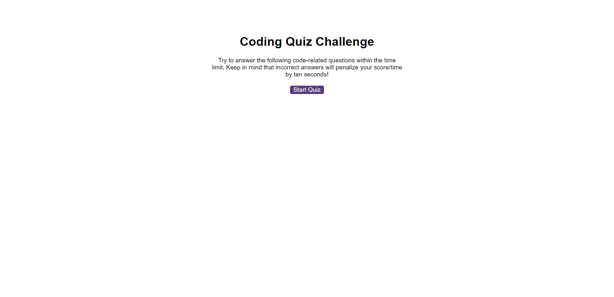

# Javascript Code Quiz

This application is to show my ability to make a coding quiz, once the button is pressed the timer start, if the timer reaches zero the quiz ends and your scores are calculated and can be inputted in the high scores board, the high scores board can be cleared with the clear button.
if the user answers a question wrong they lose 10 seconds off the timer, if they answer correctly they will be given 10 points.
Enjoy the game 

## link to the deployed application 

https://marcahudson26.github.io/automatic-octo-eureka--quiz/

## screenshot of the working application

